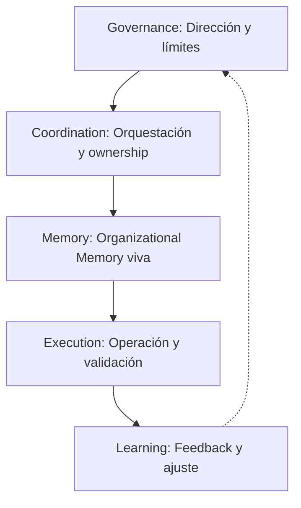

# AI Operating Model: cómo organizar equipos, procesos y arquitectura para escalar la IA en la empresa

He visto organizaciones invertir millones en copilots, agentes y plataformas de IA para descubrir meses después que el problema nunca fue tecnológico. El problema era organizativo. En una multinacional financiera, la compra de licencias de IA generó entusiasmo inicial, pero a los seis meses el uso real era marginal: los equipos no sabían cómo adaptar los outputs de la IA a sus flujos de trabajo, y la documentación interna era tan opaca que cada integración requería semanas de "arqueología organizativa". En una telco, el despliegue de un chatbot de IA fracasó porque las APIs y la documentación estaban desactualizadas. El equipo de soporte carecía de acceso al conocimiento histórico de procesos críticos. La IA no resolvió el problema: lo expuso y lo amplificó.

La mayoría de las empresas que fracasan en su transformación IA no lo hacen por falta de modelos avanzados, sino por la ausencia de un sistema operativo organizativo capaz de coordinar personas, procesos, conocimiento y agentes. La IA no escala mediante herramientas. La IA escala mediante coordinación. Y la coordinación requiere un AI Operating Model.


## La capa olvidada entre el governance y la ejecución

En la mayoría de las empresas, la conversación sobre IA se mueve entre dos extremos: la estrategia y la ejecución. Se habla de visión, de objetivos, de "ser AI-Ready". Se habla de pilotos, de copilots, de despliegues en producción. Pero entre ambos extremos hay una capa crítica que casi siempre se ignora: el modelo operativo.

...
Strategy --> Governance --> Operating Model --> Execution
...

## Qué es realmente un AI Operating Model

Un AI Operating Model no es una lista de herramientas ni un organigrama. Es el sistema que define cómo se coordinan personas, procesos, conocimiento y agentes para operar IA a escala. No es estrategia, no es governance, no es arquitectura técnica. Es la infraestructura invisible que convierte capacidades aisladas en una capacidad organizativa sostenible.

He visto empresas con todos los copilots del mercado y ninguna capacidad real de aprendizaje colectivo. En una empresa pública, la falta de onboarding técnico para la IA provocó que los nuevos modelos cometieran errores básicos en la interpretación de normativas locales. Nadie había documentado las excepciones regulatorias, y la IA, sin ese contexto, generó informes que expusieron a la organización a sanciones. También he visto organizaciones con menos recursos, pero con un modelo operativo claro, escalar IA en procesos críticos y acelerar el onboarding de nuevos equipos en semanas, no meses.

El AI Operating Model responde a preguntas que rara vez aparecen en los planes de transformación:
- ¿Quién coordina la integración de IA en los procesos clave?
- ¿Cómo se transfiere el conocimiento entre equipos y generaciones?
- ¿Dónde reside la accountability cuando la IA toma decisiones?
- ¿Qué mecanismos existen para aprender de los errores y ajustar el rumbo?

## Governance vs Operating Model

La confusión entre governance y modelo operativo es una de las causas más frecuentes de fracaso. El governance define quién decide, bajo qué reglas y con qué accountability. El modelo operativo define cómo funciona la organización en la práctica: procesos, roles, coordinación, flujos de conocimiento.

| Dimensión      | Governance                  | Operating Model           |
|---------------|-----------------------------|--------------------------|
| Decisión      | Quién, bajo qué reglas      | Cómo, con qué procesos   |
| Accountability| Supervisión, control        | Ejecución, ownership     |
| Políticas     | Definición y validación     | Implementación           |
| Supervisión   | Auditoría, reporting        | Coordinación, feedback   |
| Rol clave     | Board, comité, AI Lead      | Equipos, Product Owners  |


He visto empresas con políticas de IA impecables, pero sin procesos claros para integrar la IA en el día a día. En una consultora global, la falta de transferencia sistemática provocó que la IA repitiera errores de proyectos anteriores y dependiera de expertos que, al irse, dejaban vacíos imposibles de cubrir. El resultado es caos: reglas sin acción o acción sin dirección. Governance sin modelo operativo es burocracia. Modelo operativo sin governance es improvisación.

## Por qué fracasan la mayoría de las transformaciones de IA

La mayoría de las transformaciones IA fracasan por motivos organizativos, no técnicos. El patrón se repite: iniciativas aisladas, equipos desconectados, conocimiento fragmentado, ownership difuso, dependencia de héroes. Los pilotos funcionan, pero nunca escalan. El conocimiento se pierde en la rotación. La accountability se diluye entre áreas. La organización acumula herramientas, pero no capacidades sostenibles.


He visto empresas celebrar el éxito de un piloto solo para descubrir, meses después, que nadie sabe cómo replicarlo en otro dominio. En una empresa industrial, la rotación de personal dejó a la IA sin acceso a reglas de negocio críticas, que solo existían en la memoria de expertos que ya no estaban. El problema no era la tecnología. Era la falta de coordinación, de transferencia de conocimiento, de un modelo operativo explícito.

## El AI Operating Model de Archwise


En Archwise, hemos sintetizado años de experiencia en un framework pragmático y propio para diseñar un AI Operating Model robusto. No es una receta universal, pero sí una brújula para evitar los errores más comunes y acelerar la madurez organizativa. Este framework no es lineal ni estático: es un sistema vivo, iterativo y adaptativo, diseñado para evolucionar junto con la organización y su contexto.



### 1. Governance: Dirección y límites
- Objetivo: Definir reglas, accountability y dirección estratégica.
- Responsabilidades: Establecer políticas, decision rights, mecanismos de supervisión.
- Riesgos: Burocracia, lentitud, desconexión con la operación.
- Señales de madurez: Políticas vivas, decision rights claros, governance adaptativo.

### 2. Coordination: Orquestación y ownership
- Objetivo: Orquestar procesos, roles y ownership para integrar IA en el flujo operativo.
- Responsabilidades: Diseñar workflows, distribuir ownership, facilitar integración IA-humanos.
- Riesgos: Silos, cuellos de botella, dependencia de héroes.
- Señales de madurez: Equipos autónomos, ownership distribuido, procesos coordinados.

### 3. Memory: Organizational Memory viva
- Objetivo: Convertir el conocimiento en infraestructura operativa y estratégica.
- Responsabilidades: Capturar organizational memory, sistematizar transferencia, mantener documentación viva y accesible.
- Riesgos: Knowledge debt, pérdida de contexto, onboarding lento, repetición de errores históricos.
- Señales de madurez: Onboarding acelerado, menos errores, aprendizaje colectivo, IA que aprende de la experiencia organizativa.

En la práctica, la Organizational Memory es el verdadero multiplicador de valor. He visto organizaciones donde la memoria institucional es un archivo muerto y otras donde se convierte en el sistema nervioso de la empresa. La diferencia es brutal: en el primer caso, la IA tropieza con los mismos errores una y otra vez; en el segundo, la IA y los humanos aprenden juntos y la curva de aprendizaje se acorta radicalmente.

La Knowledge Debt es el enemigo silencioso de la arquitectura moderna. Se manifiesta cuando solo unos pocos conocen las reglas críticas, cuando las decisiones no están documentadas o cuando la rotación del equipo provoca pérdida de contexto. Cada decisión no documentada es una mina esperando a explotar. El framework Archwise pone la memoria organizativa en el centro, no como un repositorio pasivo, sino como infraestructura activa y estratégica.

### 4. Execution: Operación y validación
- Objetivo: Operar la IA en procesos críticos, asegurar calidad y resultados.
- Responsabilidades: Integrar IA en workflows, validar outputs, medir impacto.
- Riesgos: Aceptar outputs IA sin criterio, falta de validación, resultados inconsistentes.
- Señales de madurez: IA integrada en procesos core, validación continua, feedback operativo.

### 5. Learning: Feedback y ajuste
- Objetivo: Cerrar el ciclo de mejora continua y madurez organizativa.
- Responsabilidades: Medir resultados, capturar aprendizajes, ajustar políticas y procesos.
- Riesgos: Estancamiento, repetición de errores, falta de feedback.
- Señales de madurez: Ciclos de mejora cortos, aprendizaje institucionalizado, evolución del modelo operativo.

Las organizaciones que escalan IA de verdad son las que convierten el modelo operativo en infraestructura crítica, no en un documento olvidado. El framework Archwise está diseñado para diagnosticar bloqueos, acelerar la transferencia de conocimiento y reducir la knowledge debt de forma sistemática.

## Los roles dentro de un AI Operating Model

La IA cambia la naturaleza de los roles organizativos. CTOs dejan de ser solo gestores de tecnología para convertirse en arquitectos de capacidades IA. Enterprise Architects diseñan la integración de IA en procesos y sistemas. AI Leads orquestan la visión y la coordinación. Product Owners alinean prioridades con el negocio. Tech Leads garantizan integración técnica y calidad. Developers pasan de implementadores a integradores de IA. Human Reviewers validan outputs y aseguran aprendizaje.


He visto equipos donde el ownership es individual y la accountability se diluye. En una fintech, la integración de IA en los pipelines de DevOps solo fue posible porque la arquitectura era modular y la documentación estaba viva. El onboarding de nuevos ingenieros —y de la propia IA— se redujo de meses a semanas, y los errores recurrentes desaparecieron casi por completo. El salto ocurre cuando el ownership se distribuye y la colaboración se sistematiza. Los equipos AI-Augmented no son solo más rápidos: son más resilientes y menos dependientes de héroes.

## Organizational Memory como capacidad operativa


En la era de la IA, el conocimiento deja de ser documentación y se convierte en infraestructura operativa y estratégica. Sin organizational memory, la IA repite errores y no escala. Context Engineering y la gestión activa de la knowledge debt son la diferencia entre una organización que aprende y una que tropieza siempre con la misma piedra.

En una empresa SaaS, la IA aceleró el onboarding de nuevos developers porque el architecture.md estaba actualizado y el contexto diferencial era accesible. El resultado fue una integración rápida y autónoma, con menos errores y mayor alineación con los objetivos del negocio. En contraste, en una empresa de energía, la falta de un architecture.md actualizado llevó a la IA a proponer soluciones incompatibles con la infraestructura real, generando retrabajo y pérdida de confianza en la tecnología. La organizational memory viva es el punto de partida para cualquier decisión técnica, y la IA lo utiliza para validar hipótesis antes de sugerir cambios.

La knowledge debt no es solo un problema técnico: es el principal obstáculo para la escalabilidad. He visto organizaciones donde la falta de transferencia de conocimiento bloquea la innovación y multiplica la dependencia de expertos individuales. El framework Archwise convierte la gestión de la knowledge debt en una práctica central, no en una tarea secundaria.

## AI Centers of Excellence

Los AI Centers of Excellence (CoE) pueden ser aceleradores o bloqueadores. Funcionan cuando están integrados con los equipos de producto, promueven transferencia de conocimiento y evitan silos. Fracasan cuando se aíslan, se vuelven gatekeepers o burocratizan la innovación.


He visto CoEs que aceleran la adopción de IA y otros que se convierten en cuellos de botella. En una empresa tecnológica, el CoE funcionó como facilitador: organizaba sesiones de transferencia de contexto y promovía la documentación viva, ayudando a resolver conflictos entre dominios y a mantener alineados los objetivos técnicos y de negocio. En contraste, en una aseguradora, el comité de IA exigía aprobar cada cambio, lo que ralentizaba la entrega y generaba frustración. El trade-off es claro: centralizar expertise y estándares, pero sin aislar la IA del negocio ni frenar la experimentación.

## El modelo de madurez de un AI Operating Model

La madurez operativa no se compra ni se improvisa. Se construye paso a paso. En Archwise proponemos cinco niveles:

1. **Experimentation**: Pilotos y pruebas aisladas, sin integración sistémica.
2. **Augmented Teams**: Equipos que usan IA como asistente, resultados locales, ownership parcial.
3. **Coordinated Processes**: Integración de IA en workflows, coordinación entre equipos, transferencia de conocimiento inicial.
4. **Formalized Operating Model**: Procesos, roles y governance explícitos, organizational memory viva, accountability clara.
5. **AI-Native Organization**: Coordinación sistémica, IA integrada en el sistema operativo organizativo, aprendizaje institucionalizado.

```text
Experimentation → Augmented Teams → Coordinated Processes → Formalized Operating Model → AI-Native Organization
```


He visto organizaciones quedarse años en el nivel 2, repitiendo pilotos y acumulando herramientas. En una multinacional industrial, la imposibilidad de acceder a datos críticos en sistemas legacy bloqueó la integración de IA para mantenimiento predictivo. El salto ocurre cuando se formaliza el modelo operativo y se invierte en memoria organizativa y coordinación. La madurez no es un destino, es una disciplina: cada avance en el modelo operativo reduce la knowledge debt y multiplica la resiliencia.

## Conclusión


La mayoría de las empresas intentan escalar IA acumulando herramientas. Las organizaciones que realmente escalan IA diseñan primero un Operating Model. Las herramientas generan capacidad. La coordinación genera escalabilidad. Pero solo la memoria organizativa viva y la gestión activa de la knowledge debt convierten la IA en una capacidad organizativa sostenible.

No es una cuestión de tecnología, sino de arquitectura organizativa y disciplina colectiva. La diferencia entre experimentar con IA y operar con IA a escala está en la calidad del modelo operativo y en la capacidad de aprender, transferir y evolucionar juntos.

## Call to Action

No te preguntes cuántas herramientas de IA tienes. Pregúntate:

- ¿Existe realmente un AI Operating Model en tu organización?
- ¿Quién coordina personas, procesos y agentes?
- ¿Cómo se transfiere el conocimiento y se mide el aprendizaje?
- ¿Dónde reside la accountability?
- ¿Qué nivel de madurez tiene tu organización?
- ¿La memoria organizativa es viva o es un archivo muerto?
- ¿La knowledge debt se gestiona activamente o se acumula en silencio?

La IA no escala sola. Escala cuando la organización convierte el conocimiento en infraestructura, la coordinación en disciplina y la memoria en ventaja competitiva. Ese es el verdadero Operating Model. Ese es el salto que separa a las empresas que experimentan con IA de las que la convierten en su sistema operativo.
