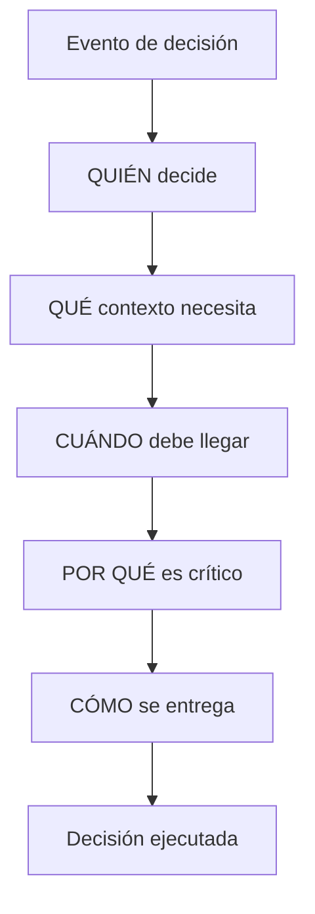
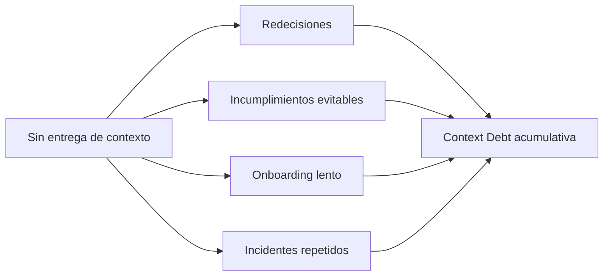

# Assets — Article 24: Context Systems

## 1) Meta Description

Las organizaciones enterprise escalan IA cuando convierten memoria en decisiones: Context Systems entregan contexto correcto a personas y agentes en el momento.

## 2) Excerpt

### Versión corta

Las organizaciones AI-Native no compiten por almacenar conocimiento, sino por entregar contexto útil cuando se toma una decisión. Ese gap tiene un coste: Context Debt.

### Versión larga

Context Systems cierra la brecha entre lo que una organización sabe y lo que realmente usa al decidir. El artículo introduce Context Debt como coste acumulativo de no distribuir contexto a tiempo, y explica por qué Context Routing se vuelve una capacidad estratégica para operar IA a escala.

## 3) Social Snippets

### LinkedIn

Muchas organizaciones ya tienen memoria organizativa y arquitectura de memoria, pero siguen redecidiendo, repitiendo incidentes y fallando en cumplimiento.

El problema no es “falta de conocimiento”.
Es falta de entrega de contexto en el momento de decisión.

En este artículo propongo una idea central:
Context Debt = coste acumulativo de saber mucho y activar poco.

Si quieres escalar IA de forma gobernable, necesitas Context Systems y Context Routing como capacidades operativas.

### X / Twitter

No gana quien más conocimiento almacena.
Gana quien mejor lo activa al decidir.

Context Debt = saber mucho, entregar poco contexto cuando importa.

Context Systems + Context Routing son clave para escalar IA con consistencia y governance.

## 4) Key Takeaways

- Almacenar conocimiento no equivale a usarlo bien en decisiones.
- Context Debt mide la distancia entre lo que la organización sabe y lo que activa al decidir.
- Context Routing es la capacidad central para entregar contexto correcto a persona/agente correcto en el momento correcto.
- Sin Context Systems, crecen redecisiones, incumplimientos evitables, onboarding lento e incidentes repetidos.
- Organizational Memory, Memory Architecture y Context Systems son capacidades complementarias, no sustitutas.
- Escalar IA con confianza exige distribución de contexto, no solo documentación o repositorios.

## 5) Internal Linking Suggestions

- article-21 — AI Operating Model Enterprise
  - Anchor sugerido: "AI Operating Model para escalar IA con roles y decisiones claras"
- article-22 — Organizational Memory
  - Anchor sugerido: "memoria organizativa como activo estratégico"
- article-23 — Memory Architecture
  - Anchor sugerido: "arquitectura de memoria para reutilización de contexto"
- article-15 — Context Engineering vs Prompt Engineering
  - Anchor sugerido: "por qué el contexto supera al ajuste local de prompts"
- article-05 — Technical Debt (conexión conceptual)
  - Anchor sugerido: "deuda técnica, deuda de conocimiento y deuda de contexto"
- article-20 — AI Governance Framework
  - Anchor sugerido: "gobernanza de IA aplicada a decisiones operativas"
- article-18 — Por qué fracasan iniciativas de IA
  - Anchor sugerido: "causas estructurales de fracaso en iniciativas de IA"

## 6) Related Articles Recommendation (máximo 5)

Priorización solicitada:

1. article-21 — AI Operating Model Enterprise
2. article-22 — Organizational Memory
3. article-23 — Memory Architecture
4. article-15 — Context Engineering vs Prompt Engineering
5. article-05 — Technical Debt (puente hacia Context Debt)

## 7) Suggested Visual Assets

### Diagrama 1: Secuencia de capacidades

Objetivo: mostrar la transición completa del artículo.

### Diagrama 2: Context Routing (núcleo operativo)

Objetivo: explicar la lógica WHO/WHAT/WHEN/POR QUÉ/CÓMO sin entrar en tooling.

### Diagrama 3: Context Debt acumulativo

Objetivo: visualizar costes crecientes sin Context Systems.

### Esquemas adicionales sugeridos

- Tabla comparativa: Technical Debt vs Knowledge Debt vs Context Debt.
- Matriz de riesgos: fragmentación, desactualización, inconsistencia, sobrecarga.
- Mapa de actores: dirección tecnológica, cumplimiento, operación, agentes.

## 8) SEO Keywords

### Principales

- context systems
- context debt
- context routing
- organizational memory
- memory architecture
- enterprise ai

### Secundarias

- distribución de contexto
- decisiones en organizaciones AI-Native
- gobernanza de contexto
- contexto para agentes de IA
- escalabilidad organizativa de IA
- entrega de contexto en tiempo de decisión

### Long-tail

- cómo implementar Context Systems en organizaciones enterprise
- qué es Context Debt y cómo reducirlo en entornos enterprise
- difference entre Organizational Memory y Context Systems
- cómo usar Context Routing para mejorar decisiones con IA
- por qué la memoria organizativa no basta para escalar IA

## 9) Publication Checklist

- [ ] Validar frontmatter final en article.md (title, date, status, category, author, readingTime, excerpt).
- [ ] Confirmar que la tesis principal aparece en apertura y cierre.
- [ ] Verificar consistencia terminológica: Context Systems, Context Routing, Context Debt.
- [ ] Revisar ortografía y estilo final (español natural, sin spanglish innecesario).
- [ ] Confirmar inclusión de ejemplos clave: CTO, cumplimiento, agente IA.
- [ ] Validar enlaces internos propuestos en el cuerpo del artículo.
- [ ] Configurar relatedArticles según la priorización definida (21, 22, 23, 15, 05).
- [ ] Verificar longitud y calidad de meta description y excerpt en canales de publicación.
- [ ] Ejecutar build de contenido/SEO/SSG y revisar salida.
- [ ] Validar render prerenderizado del artículo en dist (contenido completo + enlaces + metadatos).
- [ ] Verificar sitemap/canonical/OG tras build y despliegue.
