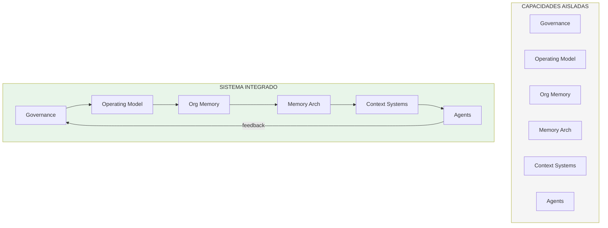

# Assets — Article 26: Framework Archwise

**Artículo:** content/enterprise-ai/article-26/article.md  
**Estado:** APPROVED - PRODUCTION READY  
**Título final:** Framework Archwise: como convertir capacidades aisladas en una capacidad operativa de IA a escala  
**Slug final:** framework-archwise-capacidad-operativa-ia-escala

---

## Criterios editoriales aplicados

- Solo assets conceptuales (visualización de integracion, no de implementación).
- Sin stock photos, sin UI/UX mockups.
- Consistencia con artículos 20-25: estilo arquitectónico, foco en decisión, lenguaje enterprise.
- Evitar duplicación de diagramas existentes:
  - No repetir el Archwise Framework Chain (article-22).
  - No repetir el Five Layers Model de Organizational Memory (article-22).
  - No repetir Memory Architecture specifics (article-23).
  - No repetir Context Routing (article-24).
  - No repetir Enterprise Agent Architecture Runtime Map (article-25).
- **Prioridad:** Enfatizar dónde ocurren fallos (en conexiones, no en componentes).
- **Tema central:** La paradoja de éxito local con fracaso global.

---

## ESSENTIAL ASSETS

### Asset 1: The Paradox — Success Local vs Failure Global

**Prioridad:** ALTA (Hero diagram del artículo)

**Objetivo:** Capturar la paradoja central del artículo en una visualización que actúe como gancho editorial inmediato.

**Mensaje:** Las organizaciones con capacidades correctas, equipos competentes y casos de éxito locales fracasan globalmente al escalar. Ese fracaso no es tecnológico; es arquitectónico.

**Tipo de visualización:** Composición visual de dos escenas lado a lado (split view).

**Contenido textual:**

**Lado izquierdo — Éxito Local (color verde)**
- Encabezado: "En cada iniciativa"
- Puntos (checkmarks verdes):
  - ✓ Governance definido
  - ✓ Equipos competentes
  - ✓ Casos de éxito medidos
  - ✓ Resultados locales positivos
  - ✓ Responsables claros por área

**Lado derecho — Fracaso Global (color rojo)**
- Encabezado: "Pero en la organización"
- Puntos (X rojas):
  - ✗ Decisiones inconsistentes entre dominios
  - ✗ Conflictos de criterio crecientes
  - ✗ Coordinación consume más energía que ejecución
  - ✗ Errores repetidos con nombres distintos
  - ✗ No se convierten avances en ventaja acumulativa

**Divisor central:**
Línea vertical con triángulo de warning. Etiqueta: "La brecha"

**Tagline inferior:**
"Tener capacidades ≠ Tener capacidad operativa"

**Ubicación sugerida:** Inicio de Acto 1 o como apoyo visual en la introducción.

**Notas de diseño:**
- Fondo oscuro (dark mode first).
- Izquierda: tonos verdes sutiles, tipografía clara.
- Derecha: tonos rojos/naranjas sutiles, tipografía clara.
- Sin iconografía decorativa. Solo tipografía y color diferenciador.
- Versión mobile: layout vertical (arriba éxito local, abajo fracaso global).

---

### Asset 2: Isolated Capabilities vs Integrated System

**Prioridad:** ALTA (Diferenciador conceptual central)

**Objetivo:** Visualizar la diferencia fundamental entre una arquitectura de capacidades aisladas y un sistema integrado.

**Mensaje:** No se trata de tener más capacidades. Se trata de cómo esas capacidades operan juntas. La diferencia entre suma aritmética y sistema es la diferencia entre fracaso y éxito a escala.

**Tipo de visualización:** Diagrama comparativo de dos arquitecturas: lado izquierdo (aisladas), lado derecho (integradas).

**Contenido textual:**

**Lado izquierdo — Capacidades Aisladas**
- Title: "El modelo de hoy (suma aritmética)"
- Seis rectángulos sin conexión explícita, dispuestos en grid 2x3:
  - Governance (aislado)
  - Operating Model (aislado)
  - Organizational Memory (aislado)
  - Memory Architecture (aislado)
  - Context Systems (aislado)
  - Enterprise Agents (aislado)
- Etiqueta debajo: "Optimiza cada función. Resultado global impredecible."
- Metáfora visual opcional: cada rectángulo con pequeño símbolo ⊗ de desconexión

**Lado derecho — Sistema Integrado**
- Title: "El modelo del Framework Archwise (sistema)"
- Seis rectángulos conectados con flechas bidireccionales que formen cadena:
  - Governance → Operating Model → Organizational Memory → Memory Architecture → Context Systems → Enterprise Agents
- Flechas de retroalimentación ascendentes (de agentes hacia governance)
- Etiqueta debajo: "Cada capa viabiliza la siguiente. Decisiones coherentes. Aprendizaje acumulativo."
- Metáfora visual: cada conexión marcada con pequeño símbolo ✓ de integración

**Columna central divisora:**
Línea gruesa con etiqueta vertival: "DIFERENCIA ESTRATÉGICA"

**Pie del diagrama:**
"La ventaja competitiva no viene de tener más capacidades aisladas. Viene de coordinar capacidades existentes como sistema."

**Ubicación sugerida:** Acto 3 "Qué diferencia una capacidad de un sistema" como visualización central.

**Notas de diseño:**
- Lado izquierdo: colores grises/neutros (para reflejar "inerte").
- Lado derecho: colores con saturación progresiva de izquierda a derecha (para reflejar "energía de flujo").
- Flechas en lado derecho en color primario Archwise.
- Rectángulos etiquetados con nombres de capas en tipografía clara.
- Versión mobile: apilar verticalmente (arriba aisladas, abajo integradas).

---

### Asset 3: The Integration Chain — Where Failures Occur

**Prioridad:** ALTA (Diagrama explicativo de causalidad)

**Objetivo:** Visualizar la cadena de integración de 6 capas con énfasis en dónde ocurren fallos (en conexiones, no en componentes).

**Mensaje:** Los fallos en escalabilidad no aparecen dentro de cada capacidad. Aparecen en las conexiones entre capas. Diagnosticar aquí es diferente que diagnosticar en componentes.

**Tipo de visualización:** Pipeline horizontal de 6 capas con "puntos de fallo" explicitados entre capas.

**Contenido textual:**

**Cadena principal (izquierda a derecha):**

```
[GOVERNANCE] 
    ↓ (Define límites y decision rights)
    
[OPERATING MODEL]
    ↓ (Ejecuta gobernanza con roles y cadencias)
    
[ORGANIZATIONAL MEMORY]
    ↓ (Preserva decisiones y aprendizajes)
    
[MEMORY ARCHITECTURE]
    ↓ (Estructura memoria para reutilización)
    
[CONTEXT SYSTEMS]
    ↓ (Entrega contexto en momento de decisión)
    
[ENTERPRISE AGENTS]
    ↓ (Aplica decisiones con autonomía gobernada)
```

**Puntos de fallo entre capas (conexiones):**

Sobre cada flecha, etiqueta de riesgo:

1. **Governance → Operating Model:**
   - Fallo: "Regla sin flujo de ejecución"
   - Síntoma: Governance percibido como freno

2. **Operating Model → Organizational Memory:**
   - Fallo: "Ejecución sin captura de contexto"
   - Síntoma: Repetición de decisiones ya tomadas

3. **Organizational Memory → Memory Architecture:**
   - Fallo: "Contenido sin estructura"
   - Síntoma: "Está en alguna wiki" (irrecuperable)

4. **Memory Architecture → Context Systems:**
   - Fallo: "Estructura sin entrega operativa"
   - Síntoma: Contexto existe pero no llega al punto de decisión

5. **Context Systems → Enterprise Agents:**
   - Fallo: "Contexto sin gobernanza integrada"
   - Síntoma: Agente toma decisión subóptima por contexto obsoleto

**Retroalimentación ascendente (opcional, anotación debajo):**
"Cada fallo de capa inferior debe propagarse hacia arriba para corrección sistémica, no solo para patch local."

**Encabezado:**
"Framework Archwise: La cadena de integración"

**Pie:**
"No falla cada capa por separado. Falla la cadena cuando una conexión se interrumpe. Diagnosticar en conexiones, no en componentes."

**Ubicación sugerida:** Acto 4 "Framework Archwise como sistema operativo organizativo" como explicación visual de la cadena.

**Notas de diseño:**
- Seis rectángulos en fila horizontal, conectados por flechas espesas.
- Cada rectángulo: nombre de capa en negrita grande arriba, pequeña descripción debajo.
- Flechas en color primario Archwise (indicando "flujo de integración").
- Etiquetas de riesgo en cada conexión en color ambar (warning).
- Síntomas en tipografía italics más pequeña, color rojo suave.
- Versión mobile: apilar vertical manteniendo flechas.

---

### Asset 4: Diagnostic Framework — Isolated vs Connected Failures

**Prioridad:** MEDIA-ALTA (Herramienta diagnóstica)

**Objetivo:** Proporcionar al lector executive una matriz para diagnosticar dónde ocurre el fallo: ¿en un componente o en la conexión?

**Mensaje:** La capacidad de diagnosticar correctamente determina la calidad de la corrección. Diagnosticar síntomas sin entender causas sistémicas genera parches, no soluciones.

**Tipo de visualización:** Tabla comparativa 2x5 (dos enfoques, cinco síntomas).

**Contenido textual:**

| **Síntoma Observable** | **Diagnóstico Incorrecto (Local)** | **Diagnóstico Correcto (Sistémico)** | **Punto de Intervención Real** |
|---|---|---|---|
| **Governance existe pero no se ejecuta** | "Hay que fortalecer governance" | Falla la conexión entre governance y operating model | Rediseñar flujo de ejecución de governance |
| **Equipos ágiles pero inconsistentes** | "Hay que mejorar coordinación" | Falla la conexión entre operating model y memoria organizativa | Captura sistemática de decisiones |
| **Conocimiento capturado pero no utilizado** | "Necesitamos mejor wiki" | Falla la conexión entre memoria y memory architecture | Rediseñar arquitectura de recuperación |
| **Contexto disponible pero no entregado** | "Necesitamos mejor context engine" | Falla la conexión entre memory architecture y context systems | Rediseñar ownership de entrega contextual |
| **Agente falla en producción** | "Mejorar el modelo" | Falla la infraestructura organizativa que alimenta al agente | Revisar cadena completa (governance → agentes) |

**Pie de tabla:**
"La diferencia entre diagnosis local y sistémica es a menudo la diferencia entre parche y solución."

**Ubicación sugerida:** Acto 2 "Por qué las capacidades aisladas fracasan" como herramienta de validación.

**Notas de diseño:**
- Encabezados de columna en color: Local en rojo suave, Sistémico en verde suave.
- Columna "Punto de Intervención Real" destacada en color primario Archwise.
- Filas alternadas en color de fondo (blanco / gris muy suave) para legibilidad.
- Versión simplificada para social: solo síntoma + punto de intervención.

---

### Asset 5: Framework Archwise Positioning in Corpus

**Prioridad:** MEDIA (Navegación editorial)

**Objetivo:** Mostrar dónde se posiciona article-26 dentro del corpus de articles 20-25 y cómo actúa como puente conceptual hacia futuro /framework.

**Mensaje:** Article-26 no es un artículo más de la serie. Es la síntesis que convierte los 6 componentes anteriores en una arquitectura sistémica. Es el ponte hacia /framework operativo.

**Tipo de visualización:** Cadena horizontal de bloques con posicionamiento diferenciado.

**Contenido textual:**

```
[Article-20]          [Article-21]          [Article-22]          [Article-23]
  Governance       →   Operating Model    →  Organizational    →   Memory
                                             Memory             Architecture

                                                    ↓
                                          
                                 [Article-26 - ARCHWISE FRAMEWORK]
                                 "Como estos 6 elementos operan como SISTEMA"
                                          
                                                    ↓

[Article-24]          [Article-25]          [/framework page]
Context Systems    →   Enterprise          →   Operativización
                       Agents                  del sistema
```

**Encabezado:**
"Article-26 en el contexto del corpus"

**Etiqueta clave:**
"Este artículo no explica cada componente. Explica por qué esos componentes necesitan operar como un sistema."

**Ubicación sugerida:** En la introducción del asset o como esquema editorial único.

**Notas de diseño:**
- Bloques 20-25 en color neutral (gris claro).
- Bloque Article-26 en color primario Archwise, significativamente más grande.
- Flechas horizontales en gris claro para 20→23 y 24→25.
- Flechas verticales desde Article-26 en color primario (mostrando que es pivot).
- Versión mobile: reformatear en dos filas (20-23 arriba, 24-26-/framework abajo).

---

## SUPPORTING ASSETS (Opcionales, bajo demanda)

### Asset S1: Friction Cost Over Time

**Prioridad:** BAJA (validación conceptual, no crítico para artículo)

**Objetivo:** Mostrar en términos cuantitativos hipotéticos cómo el coste de coordinación crece cuando no hay integración sistemática.

**Tipo:** Gráfico de dos curvas (tiempo vs coste de coordinación).

**Contenido:**
- Curva A (sin integración): crece exponencialmente
- Curva B (con integración framework): crece lineal o decrece
- Eje X: tiempo (meses)
- Eje Y: % energia gastada en coordinación vs ejecución
- Divergencia visible a partir de mes 6

---

### Asset S2: Maturity Levels — Organization without System

**Prioridad:** BAJA (diagnóstico, no crítico para narrativa)

**Objetivo:** Proporcionar escala de madurez para que organizaciones autoevalúen si tienen "capacidades sin sistema" vs "capacidades integradas".

**Tipo:** Tabla de 4 niveles con características observables.

**Niveles:**
1. **No Capabilities** — Ausencia total de governance/memory/operating model
2. **Islands of Capability** — Capacidades existen pero operan en silos (este es el caso del artículo)
3. **Partial Integration** — Algunas conexiones explicitas pero no toda la cadena
4. **System Integration** — Cadena completa con feedback y aprendizaje acumulativo

---

## NOTAS PARA DISEÑADOR

### Estilo y Tono
- **Color palette:** Mantener consistencia con Archwise (primario + tonos ejecutivos).
- **Tipografía:** Sans-serif moderno, legible en pequeño tamaño.
- **Iconografía:** Minimal. Solo si aporta claridad, no decorativo.
- **Densidad visual:** Los diagramas deben ser "parseables" en 15 segundos por ejecutivo.

### Coherencia Series
- Asset 2 (Isolated vs Integrated) es el "hermano visual" de Asset 2 de article-22 (Five Layers Model).
- Asset 3 (Integration Chain) extiende el concepto de Archwise Chain de article-22.
- Asset 4 (Diagnostic) es similar en estructura a Asset 2 de article-25 (Failure Modes Matrix).

### Formatos Entregables
- **Web:** Mermaid diagrams (para article.md incrustado)
- **Diseño editorial:** Excalidraw specs o Figma mockups
- **Social:** Versiones simplificadas (750x750px para LinkedIn, 1200x600px para blog).

### Prioridad de Entrega
1. **ALTA:** Assets 1, 2, 3 (son críticos para narrativa)
2. **MEDIA:** Asset 4 (soporte diagnostico)
3. **MEDIA:** Asset 5 (navegación editorial)
4. **BAJA:** Assets S1, S2 (opcionales, bajo demanda)

---

## MERMAID DIAGRAM CANDIDATES

### Diagram 1: Integration Chain (Asset 3) en Mermaid

```mermaid
graph LR
    A["<b>GOVERNANCE</b><br/>Limites & Decision Rights"] -->|Regla sin flujo| B["<b>OPERATING MODEL</b><br/>Ejecución & Roles"]
    B -->|Ejecución sin captura| C["<b>ORG MEMORY</b><br/>Decisiones & Aprendizajes"]
    C -->|Contenido sin estructura| D["<b>MEMORY ARCH</b><br/>Estructura & Recuperación"]
    D -->|Estructura sin entrega| E["<b>CONTEXT SYSTEMS</b><br/>Contexto en Decisión"]
    E -->|Contexto sin gobernanza| F["<b>ENTERPRISE AGENTS</b><br/>Decisiones con Autonomía"]
    
    F -->|Feedback| A
    
    style A fill:#e1f5ff
    style B fill:#b3e5fc
    style C fill:#81d4fa
    style D fill:#4fc3f7
    style E fill:#29b6f6
    style F fill:#03a9f4
```



### Diagram 2: Isolated vs Integrated (Asset 2) en Mermaid



---

## INTERNAL NOTES

- Article-26 actúa como "sintetizador" de la serie 20-25. Sus assets deben reforzar esa posición sin repetir.
- El diagrama principal (Asset 2) es diferenciador: la mayoría de empresas entienden capacidades pero NO operan sistemas integrados.
- Asset 3 (Integration Chain) es el corazón visual del artículo. Debe ser impactante y memorizable.
- El orden sugerido de lectura visual: Asset 1 (paradoja) → Asset 2 (diferencia) → Asset 3 (solución).

